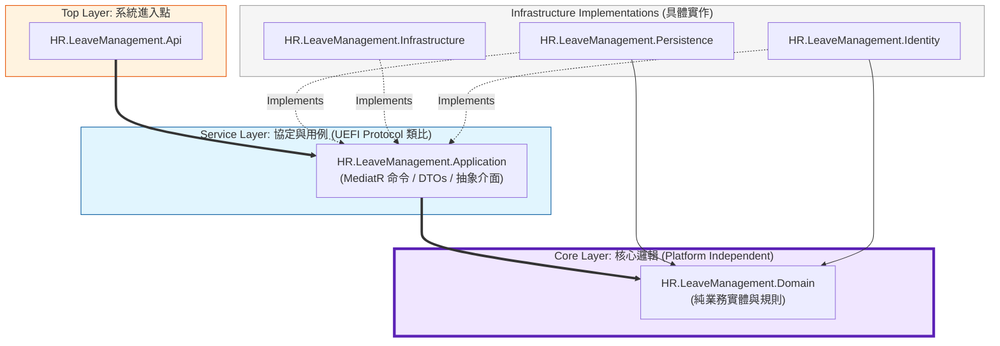

### HR.LeaveManagement 系統架構與設計邏輯

---

## 系統分層與模組說明（摘要表）

| 層級 / 模組 | 核心責任 | 與其他層的關係 | 平台依賴性與備註 |
|------------|----------|----------------|------------------|
| **Domain（HR.LeaveManagement.Domain）** | 定義請假相關的核心概念（請假類型、請假申請、配額等）與業務規則，維持系統最穩定、不易改變的知識。 | 被其他所有後端模組依賴，但不反向依賴任何外部實作。 | 嚴格避免依賴資料庫、Web 框架或第三方套件，保持高度與平台無關，可類比為「純演算法與資料結構層」，對應硬體世界中的邏輯設計而非具體裝置。 |
| **Application（HR.LeaveManagement.Application）** | 組織各種用例（Use Cases），定義輸入/輸出模型與存取介面，負責協調領域物件的使用與狀態變更。 | 依賴 Domain 的型別與規則，並只透過介面（Contracts）向外宣告對資料存取、身份驗證、記錄等服務的需求。 | 嚴格面向介面開發，不直接知道資料庫或網頁技術細節，可被不同的上層入口（REST API、gRPC、批次服務等）重複使用，類似於以「協定/規格」驅動的邏輯控制層。 |
| **Persistence（HR.LeaveManagement.Persistence）** | 具體實作資料存取邏輯，將 Application 定義的存取介面對應到底層資料庫操作。 | 依賴 Application 中定義的存取介面與 Domain 的實體，向下則連接實際的資料庫。 | 目前以 SQL Server 與相關 ORM 技術為主，但可透過替換此層實現來導入不同資料庫，而不影響上層邏輯。 |
| **Infrastructure（HR.LeaveManagement.Infrastructure）** | 實作跨領域的技術服務，例如記錄、郵件、檔案等週邊能力。 | 依 Application 的服務介面，為上層提供實際可運行的技術支援。 | 此層可隨實際運維需求更換實作（例如改變記錄或郵件供應商），不影響業務邏輯與領域模型。 |
| **Identity（HR.LeaveManagement.Identity）** | 實作使用者管理與權限控管，包含帳號、認證與角色資訊。 | 對 Application 暴露身分與授權相關的介面，並可依環境採用不同的憑證或授權策略。 | 以具體身分管理技術建構，但對上層來說只是一組介面，可視需要調整認證機制。 |
| **後端入口（HR.LeaveManagement.Api）** | 作為後端邏輯對外的唯一進入點，負責接收外部請求、轉為內部用例呼叫、回傳標準化結果。 | 依賴 Application 暴露的用例與介面，不直接操作資料庫與基礎設施。 | 雖然目前以 Web API 形式存在，但可視為一個「介面層」，未來若改採其他通訊協定（如訊息匯流排或批次觸發），只需重寫此層。 |
| **反向代理（reverse_proxy / Nginx）** | 統一處理對外連線、TLS 終結、路由與靜態檔案服務，同時將後端入口與資料庫隔離於內部網路。 | 向外暴露 HTTP/HTTPS 入口，向內將請求導向後端入口與其他服務。 | 純屬基礎設施配置層，不參與業務邏輯；可隨佈署環境替換為其他反向代理或負載平衡器。 |
| **資料庫（mssql / SQL Server）** | 儲存系統狀態與交易資料，確保資料持久性與一致性。 | 與 Persistence 層緊密合作，由 Persistence 層負責轉譯 Domain 實體至實際資料表。 | 作為一個可替換的儲存後端，若未來調整為其他關聯式或非關聯式資料庫，變更集中於 Persistence 與部分設定。 |

---

## 核心架構關係（表格化示意）

| 範疇 | 元件 / 層級 | 角色說明 | 依賴方向（由外向內） |
|------|------------|----------|----------------------|
| 對外存取與邊界 | 使用者 / 前端瀏覽器 | 透過瀏覽器或前端應用程式，以 HTTP/HTTPS 存取系統。 | 僅呼叫反向代理提供的公開入口，不直接接觸後端內部模組。 |
| 對外存取與邊界 | 反向代理（reverse_proxy / Nginx） | 管理對外連線、TLS 終結、路由與靜態檔案服務，並將請求導向後端入口。 | 依賴後端入口 `API` 與靜態檔案來源，不參與業務邏輯。 |
| 後端入口 | 後端入口（HR.LeaveManagement.Api） | 接收來自反向代理或其他用戶端的請求，負責協調驗證、轉換輸入，並呼叫對應的應用層用例。 | 依賴 Application 層的用例與介面，不直接操作資料庫與外部基礎設施。 |
| 應用邏輯 | Application（HR.LeaveManagement.Application） | 將單一請求拆解為具體用例，組織命令與查詢，協調領域物件與外部服務的互動。 | 依賴 Domain 的型別與規則，並依賴由 Persistence / Infrastructure / Identity 提供的介面實作。 |
| 核心領域 | Domain（HR.LeaveManagement.Domain） | 承載請假領域的核心概念與不變條件，定義實體、值物件與重要規則。 | 不依賴任何外部層級，是所有後端邏輯的穩定基礎。 |
| 技術實作 | Persistence（HR.LeaveManagement.Persistence） | 實作資料庫存取，負責將 Domain 實體與資料表之間互相轉換。 | 依賴 Application 定義的存取介面與 Domain 型別，向下連接 SQL Server。 |
| 技術實作 | Infrastructure（HR.LeaveManagement.Infrastructure） | 提供記錄、郵件、檔案等跨領域共用服務的具體實作。 | 依賴 Application 定義的服務介面，可依照運維需求替換實作而不影響上層。 |
| 技術實作 | Identity（HR.LeaveManagement.Identity） | 提供帳號、認證與角色管理的實作，確保用戶身分與權限控制。 | 依賴 Application 定義的身分管理介面，並視需要使用特定認證方案。 |
| 資料儲存 | 資料庫（mssql / SQL Server） | 儲存所有業務資料與交易紀錄，確保資料一致性與持久化。 | 與 Persistence 層緊密連結，但對上層僅以抽象資料存取介面呈現，可被其他資料庫替換。 |

---

## 設計原則說明

### 1. 解耦（Decoupling）：Domain 層不依賴外部工具

- **Domain 層職責**  
  `HR.LeaveManagement.Domain` 承載系統中最穩定的商業語意：  
  - 請假類型、請假申請、請假配額等**領域實體**與對應的**值物件**。  
  - 像是「是否可核准」、「配額是否足夠」等**業務規則**，以方法或規則集中在實體本身或領域服務中。

- **不依賴外部框架與技術細節**  
  Domain 層設計上**不參考任何基礎設施或框架型套件**（例如 EF Core、Logging Library、ASP.NET Core 等），只會：  
  - 使用純 C# 語言元素（class、struct、interface、enum）。  
  - 以**介面（interface）或抽象型別**宣告對外部行為的期望，而不實際連結具體實作。  
  - 避免直接使用 `DbContext`、`HttpContext` 或第三方 SDK，這些皆留在外圍層處理。

- **效益**  
  - 領域模型可以**獨立測試**與演進，而不受資料庫或框架升級的影響。  
  - 若未來由 SQL Server 改為 PostgreSQL，或 API 由 ASP.NET Core 改為其他技術，Domain 層原則上可維持不變。  
  - 對於長期維護與重構，整體風險與成本大幅降低。  
  - 從系統底層的角度看，這種作法類似於在硬體抽象層（Hardware Abstraction Layer, HAL）上方維持一組與實際裝置無關的邏輯規範，使邏輯層在硬體組態變化下仍能穩定運作。

**在高複雜度環境下，此種解耦設計可將變動集中在外圍實作層，確保核心邏輯在硬體或基礎設施頻繁變更時仍維持穩定。**

---

### 2. 介面導向開發（Interface-Based）：先定義 Contracts 再實作

- **Application 層 Contracts**  
  `HR.LeaveManagement.Application` 中定義**對外依賴的抽象契約（Contracts）**，例如：  
  - 資料存取介面：`ILeaveTypeRepository`, `ILeaveAllocationRepository`, `IUnitOfWork` 等。  
  - 身分驗證與使用者服務：`IAuthService`, `IUserService`。  
  - 系統服務：`IEmailService`, `ILoggingService` 之類的基礎設施介面。

- **實作分佈於外圍層**  
  - `HR.LeaveManagement.Persistence`：實作各種 Repository 與 Unit of Work，具體使用 EF Core、DbContext、LINQ 等技術；對 Application 而言，僅以介面視之。  
  - `HR.LeaveManagement.Infrastructure`：實作寄信、記錄 Log 等功能，可替換不同供應商（SMTP、第三方 API、不同 Logger）。  
  - `HR.LeaveManagement.Identity`：實作 JWT Token 產生、Refresh Token 機制、角色與使用者管理，對外也僅以 `IAuthService` / `IUserService` 提供介面。

- **IoC / DI 組態**  
  - 在 `HR.LeaveManagement.Api` 的啟動程式中（例如 `Program.cs` / `Startup` 類型），利用 ASP.NET Core 內建相依性注入（Dependency Injection, DI）容器，將 `ILeaveTypeRepository` 綁定到 `LeaveTypeRepository`，將 `IAuthService` 綁定到具體實作等。  
  - 入口邏輯與處理程序只注入介面，不直接建立實例，達到**鬆耦合**與**可替換性**。

- **風格與好處**  
  - 開發流程偏向**先定義介面、先定義 Use Case 合約，再往外補實作**。  
  - 未來要接入新的日誌系統、寄信供應商或更換 Identity 機制，只需在外圍層調整，不影響 Application 與 Domain。  
  - 對熟悉硬體 / 韌體之工程組織而言，可視為「定義 Spec 與介面後，再提供不同 Driver/Adapter 實作」：類似 UEFI Protocol / Spec-First 的開發模式，先訂定協定與介面，再透過不同 Driver 實作支援多種平台。

**在高複雜度環境下，此種介面導向與 DI 結合的設計，能夠在更換底層實作或整合新模組時，避免連鎖修改核心程式碼，維持系統整體行為的一致與穩定。**

---

### 3. 非同步處理：利用 CQRS 與分離式請求處理流程提升系統反應效率

- **CQRS 模型**  
  - 在 `Application` 層中，將讀寫操作拆分為**命令（Command）**與**查詢（Query）**兩條路徑（Command Query Responsibility Segregation, CQRS）：  
    - Command：負責**狀態變更**與商業規則執行。  
    - Query：專注於**資料讀取**與查詢投影。  
  - 後端入口只負責將外部請求轉換為對應的 Command/Query 物件，再交由內部邏輯流程處理。

- **內部邏輯派發與管線**  
  - 每一種命令或查詢對應一個獨立的邏輯處理程序，專注於單一業務用例。  
  - 在處理程序之前與之中，可插入標準化的共用流程（例如驗證、記錄、交易控制），形成具可插拔性的處理管線。  
  - 這種設計不綁定特定 Web 技術或函式庫，可在不同通訊介面（HTTP、訊息佇列、排程作業）間重複使用。

- **非同步與效能**  
  - Handler 與 Repository 操作以 `async/await` 為主，搭配 EF Core 的非同步查詢與寫入，減少 Thread Blocking。  
  - 在高併發場景下，非同步 I/O 呼叫（資料庫、Email、外部服務）有助於提升**資源使用效率與整體吞吐量**。  
  - 若未來導入事件驅動架構（Domain Events / Integration Events），可搭配內部事件派發機制，進一步分散工作負載並消弭同步耦合。

**在高複雜度與高併發環境下，CQRS 加上明確的非同步處理流程，可以將讀寫壓力分離並限制每個處理單元的責任範圍，使系統在負載波動與功能擴充時仍能維持穩定度與可預測性。**

---

### 4. 系統佈署：Docker Compose（Nginx + API + DB）

- **整體概念**  
  專案根目錄的 `docker-compose.yml` 定義了一個標準的三層部署：  
  - `reverse_proxy`：Nginx 容器，負責提供前端靜態檔與反向代理 API。  
  - `api`：封裝 `HR.LeaveManagement.Api` 的 ASP.NET Core Web API 容器。  
  - `mssql`：SQL Server 容器，提供主資料庫服務。  
  三者透過 `hr_leave_management_network` 自訂 Bridge Network 以固定 IP 進行溝通。

- **Nginx（reverse_proxy 容器）**  
  - 使用 `./conf/nginx/nginx.conf` 與 `./conf/nginx/conf.d` 管理虛擬主機與反向代理規則。  
  - 掛載 `./frontend/hr-leave-management-ui/dist` 作為靜態站台根目錄，負責提供前端靜態資源。  
  - 透過 `${NGINX_HTTP_OUTER_PORT}` / `${NGINX_HTTPS_OUTER_PORT}` 對外暴露 HTTP/HTTPS 服務，內部則映射到 Nginx 容器內部 Port。

- **API（HR.LeaveManagement.Api 容器）**  
  - `Dockerfile` 基於 Ubuntu 22.04，安裝指定版本的 .NET SDK，並在建置階段執行：  
    - `dotnet publish api/HR.LeaveManagement.Api/HR.LeaveManagement.Api.csproj -c Release -o /deploy/api`  
  - 執行時於 `/deploy/api` 啟動 `dotnet HR.LeaveManagement.Api.dll` 作為 API Entry Point。  
  - Web API 透過 `${API_OUTER_PORT}` 映射外部 Port，內部則以 `ASPNETCORE_URLS` 設定實際監聽位址。  
  - Logs 與上傳檔案（Images）掛載到主機對應目錄，以利持久化與運維分析。

- **SQL Server（mssql 容器）**  
  - 使用 `./conf/mssql/Dockerfile` 建置專用 SQL Server 容器。  
  - 資料、備份、Log 與機密檔（secrets）目錄映射至主機，以便備份與異地還原。  
  - 採用 `.env` 檔中的 `MSSQL_*` 變數設定 SA 密碼、Collation、授權模式與 HADR 相關參數。  
  - 對外經由 `${MSSQL_OUTER_PORT}` 供開發 / 維運者連線，內部則透過固定 IP 在 `hr_leave_management_network` 上提供服務給 `api`。

- **環境參數與彈性**  
  - `.env` 檔統一管理：  
    - 各服務 Container 名稱、版本與 Tag。  
    - 內外 Port 映射、Network Subnet / Gateway / IP 分配。  
    - SQL Server 相關認證與資料庫設定。  
  - 在實務部署上，可依環境（Dev / QA / Prod）維護不同 `.env` 檔以調整 Port、IP、資源限制與 Log 路徑，無須改動程式碼。
  
**在高複雜度環境下，透過 Docker Compose 將 Nginx、API 與 SQL Server 明確分離並以設定檔描述依賴關係，可以像管理多顆不同功能晶片一樣清楚控管各服務邊界與行為，讓佈署、升級與問題隔離更加可預期且穩定。**

---