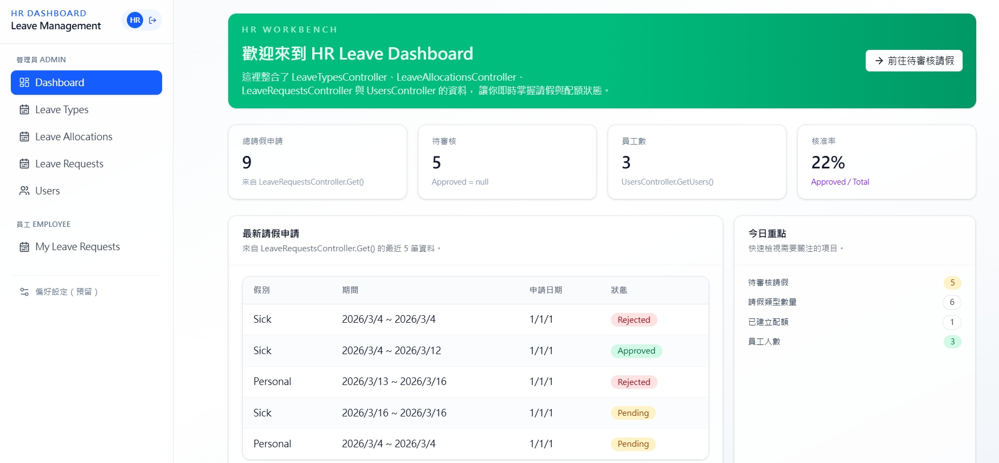
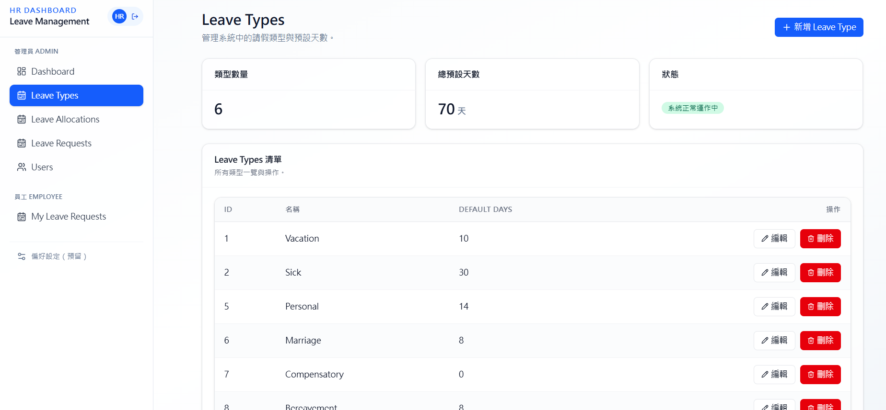
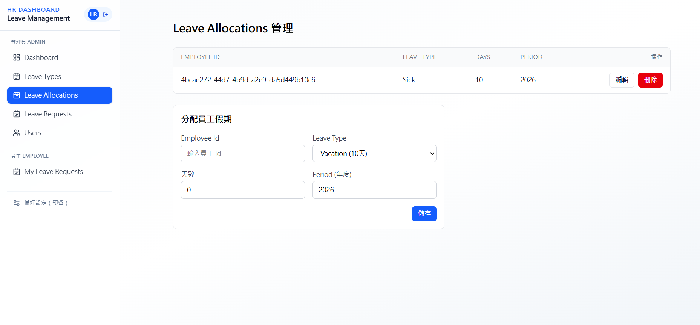
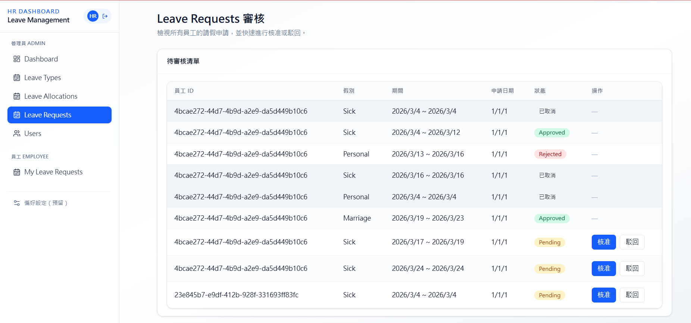
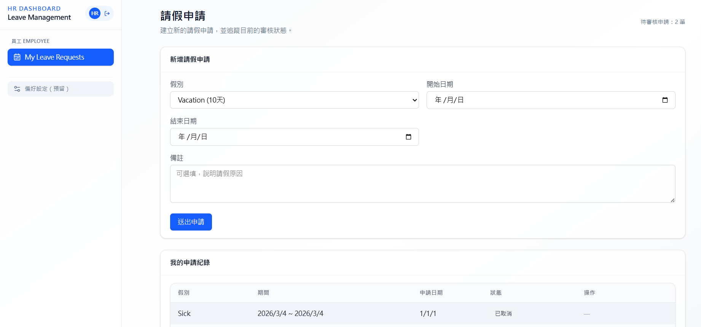

# HR.LeaveManagement.Clean

請假管理系統後端與前端專案，採用 Clean Architecture 與 React 前後端分離。

---

## 專案架構

### 後端（Clean Architecture）

後端位於 `api/`，依依賴方向由內而外分層：

| 專案 | 說明 |
|------|------|
| **HR.LeaveManagement.Domain** | 領域實體與共通介面，不依賴其他層。 |
| **HR.LeaveManagement.Application** | 應用邏輯：CQRS（MediatR）、DTO、介面（Persistence、Identity、Logging 等）。 |
| **HR.LeaveManagement.Persistence** | 資料存取：EF Core、Repository 實作。 |
| **HR.LeaveManagement.Infrastructure** | 基礎設施：Logging、Email 等實作。 |
| **HR.LeaveManagement.Identity** | 身分驗證：ASP.NET Core Identity、JWT、Refresh Token、IAuthService / IUserService 實作。 |
| **HR.LeaveManagement.Api** | Web API：Controllers、Middleware、DI 組態。 |

- **CQRS**：查詢（Query）與命令（Command）經由 MediatR 派發至對應 Handler。
- **授權**：JWT Bearer，角色包含 `Administrator`、`Employee`；列表查詢依角色過濾（員工僅見自己的請假單）。

### 前端

- 位置：`frontend/hr-leave-management-ui/`
- 技術：React（Function Components）、TypeScript、Vite、Tailwind CSS。
- 架構：domain / application / infrastructure / presentation 分層，API 呼叫與 JWT 在 infrastructure，UI 在 presentation。
- 功能：登入、註冊、Dashboard、Leave Types（管理員）、Leave Allocations（管理員）、Leave Requests（員工申請與管理員審核）、使用者列表（管理員）；依 JWT 角色顯示/隱藏 Admin 選單並以 `AdminRoute` 保護 `/admin/*` 路由。

---

## Web API 說明

- **Base URL**：`/api/v1`（版本 1.0，Asp.Versioning）。
- **認證**：除 Auth 的 Login / Register / Refresh-Token 外，其餘需在 Header 帶上 `Authorization: Bearer <token>`。
- **角色**：`Administrator`、`Employee`；各端點所需角色見下表。

---

### Auth（`/api/v1/Auth`）

| 方法 | 路徑 | 授權 | 說明 |
|------|------|------|------|
| POST | `/Login` | 無 | 登入，Body: `AuthRequest`（email, password），回傳 token、refreshToken、id 等。 |
| POST | `/Register` | 無 | 註冊，Body: `RegistrationRequest`（firstName, lastName, email, userName, password），回傳 userId。 |
| POST | `/Refresh-Token` | 無 | 以 jwtToken、refreshToken 換新 token。 |
| POST | `/Logout` | 登入 | 登出，Body: `TokenRequest`（含 refreshToken）。 |

---

### LeaveTypes（`/api/v1/LeaveTypes`）

| 方法 | 路徑 | 授權 | 說明 |
|------|------|------|------|
| GET | `/` | Administrator, Employee | 取得所有請假類型。 |
| GET | `/{id}` | Administrator, Employee | 取得單一請假類型明細。 |
| POST | `/` | Administrator | 新增請假類型，Body: CreateLeaveTypeCommand。 |
| PUT | `/{id}` | Administrator | 更新請假類型。 |
| DELETE | `/{id}` | Administrator | 刪除請假類型。 |

---

### LeaveAllocations（`/api/v1/LeaveAllocations`）

| 方法 | 路徑 | 授權 | 說明 |
|------|------|------|------|
| GET | `/` | Administrator, Employee | 取得所有請假配額。 |
| GET | `/{id}` | Administrator, Employee | 取得單一配額明細。 |
| POST | `/` | Administrator | 新增配額。 |
| PUT | `/{id}` | Administrator | 更新配額。 |
| DELETE | `/{id}` | Administrator | 刪除配額。 |

---

### LeaveRequests（`/api/v1/LeaveRequests`）

| 方法 | 路徑 | 授權 | 說明 |
|------|------|------|------|
| GET | `/` | Administrator, Employee | 取得請假申請列表；Employee 僅回傳自己的申請。 |
| GET | `/{id}` | Administrator, Employee | 取得單一請假申請明細。 |
| POST | `/` | Administrator, Employee | 新增請假申請，Body: CreateLeaveRequestCommand。 |
| PUT | `/{id}` | Administrator, Employee | 更新請假申請。 |
| DELETE | `/{id}` | Administrator | 刪除請假申請。 |
| PUT | `/{id}/approve` | Administrator | 核准/駁回，Body: ChangeLeaveRequestApprovalCommand（approved）。 |
| PUT | `/{id}/cancel` | Administrator, Employee | 取消請假申請。 |

---

### Users（`/api/v1/Users`）

| 方法 | 路徑 | 授權 | 說明 |
|------|------|------|------|
| GET | `/` | Administrator | 取得員工列表。 |
| GET | `/{id}` | Administrator | 取得單一員工明細。 |

---

## Docker 與部署（docker-compose）

專案根目錄的 `docker-compose.yml` 會建立三個服務：

- **reverse_proxy（nginx）**：  
  - 服務靜態前端（`frontend/hr-leave-management-ui/dist`）。  
  - 反向代理 API 至 `api` 服務。  
  - 使用 `${NGINX_HTTP_OUTER_PORT}` / `${NGINX_HTTPS_OUTER_PORT}` 對外提供 HTTP/HTTPS。

- **api（HR.LeaveManagement.Api）**：  
  - 執行 ASP.NET Core Web API。  
  - 對外使用 `${API_OUTER_PORT}`，內部 URL 由 `ASPNETCORE_URLS` 控制。  
  - 掛載 Logs 與 Images 目錄以便持久化。

- **mssql（SQL Server）**：  
  - 提供系統資料庫，帳號、密碼與 Collation 由 `.env` 中的 `MSSQL_*` 參數設定。  
  - 使用 `${MSSQL_OUTER_PORT}` 對外連線，資料與備份目錄皆映射到本機。

### 快速啟動步驟

1. 準備環境變數檔（`.env` 或 `${ENV_FILE_PATH}`），填入各種 `${...}` 參數（Port、IP、SQL 密碼等）。  
2. 在 `frontend/hr-leave-management-ui` 執行 `npm install && npm run build`，產生 `dist` 靜態檔。  
3. 於專案根目錄執行：

   ```bash
   docker-compose up -d --build
   ```

4. 透過瀏覽器以 `http(s)://<host>:${NGINX_HTTP_OUTER_PORT}` 或 `${NGINX_HTTPS_OUTER_PORT}` 存取系統入口。

---

## 前端 UI 截圖展示

- **Dashboard 範例**

  

- **Admin 功能頁**

  

  

  

- **Employee 功能頁**

  

---
## 如何執行（開發模式）

- **後端**：於 `api/` 開啟 solution，將 `HR.LeaveManagement.Api` 設為啟始專案，執行即可（需設定好資料庫與 Identity）。
- **前端**：於 `frontend/hr-leave-management-ui/` 執行 `npm install` 後 `npm run dev`，並在 `.env` 設定 `VITE_API_URL` 指向後端位址（例如 `https://localhost:7133`）。
